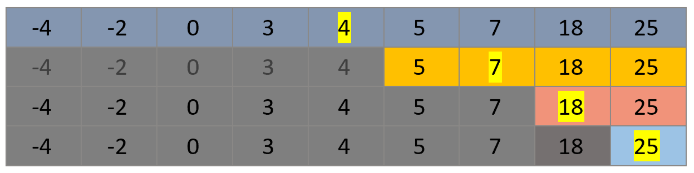

# Algorithms - Search

## Linear Search

A linear search is an algorithm that we can use to find a value in an array *(slice)*.  The algorithm begins by looking at the first element in the array *(slice)*, and then moves to the next element and the next element, in sequence, until it finds the value or reaches the end of the array *(slice)*.

The **main advantages** of the linear search include:

1. It is a simple algorithm;
2. It does not require the array *(slice)* to be sorted in any order.
  
The **main disadvantage** is that if you have many elements in an array *(slice)*, it is a slow algorithm.  In the worst case, if the element is at the end of the array *(slice)*, every element must be looked at.  On average, half the elements must be looked at to find the value being searched for, if it exists in the slice.

[Linear Search Video](https://youtu.be/TwsgCHYmbbA)

## Binary Search

A binary search is also an algorithm that we can use to find an value in an array *(slice)*.  However, it goes about the process in a very different way compared with a linear search.  First of all, the array *(slice)* **must be sorted** - this will be used to our advantage.  When looking for a value, we can first look at the middle element.  If the middle element is lower than the value being searched for, we know we only need to look at the second half of the array *(slice)* in the next step.  If the middle element is higher than the value being searched for, we only need to look in the first half of the slice in the next step.  So, with each step, we reduce to number of elements to be searched by half.  In each step, we look at the middle element of the portion of the array *(slice)* we are searching, and divide the slice in half depending on whether the middle element is higher or lower than the value being searched for.  This search algorithm is the best way of playing the guessing game that you may have created in 11 Computer Science.

The **main advantage** of this algorithm is its **speed**.  For example, to find a value in an array *(slice)* of 100 elements only requires 7 steps, since 2^7= 128, and our array is smaller than this power of 2.

Its **main disadvantages** are:
1. The array must first be **sorted**;
2. The algorithm is **more complex** than the linear search.

Here is a visual description of how the algorithm works:

For example, let's say we are looking for the value 25.  Here is visually how the algorithm would work.



There are **4 steps** in this example, since 2^4= 16 and our array has a length of 9.  The number of steps lies between 2^3= 8 and 2^4= 16, so the larger number of steps is required.

[Binary Search Video](https://youtu.be/T98PIp4omUA)

## Task

In Visual Studio Code, create a folder called **Algorithms-Search** and then open it. Now open a new Terminal window.

1. Create a **lin_search.rs** file and using the starter code below, modify the function ```lin_search(n: i32, values:  &[i32]) -> i32```, so that it uses the **linear search** algorithm to find the integer **n** in the array slice *(of i32 values)* and **returns the index** where the item is found or -1 if **n** is not in the array slice.

```rust
fn main(){
    let a = [8, -5, 10, -1, 2, 15, -23, 0];
    let num = 0;
    println!("Index: {}", lin_search(num, &a));
}

fn lin_search(n: i32, values: &[i32]) -> i32 {
    -1
}
```

2. Create a **bin_search.rs** file and using the starter code below, modify the function ```bin_search(n: i32, values:  &[i32]) -> i32```, so that it uses the **binary search** algorithm to find the integer **n** in the array slice *(of i32 values)* and **returns the index** where the item is found or -1 if **n** is not in the array slice.

```rust
fn main(){
    let a = [-23, -5, -1, 0, 2, 8, 10, 15];
    let num = -23;
    println!("Index: {}", bin_search(num, &a));
}

fn bin_search(n: i32, values: &[i32]) -> i32 {
    // assumes a sorted array slice
    let mut index = -1;
    let mut lower = 0;
    let mut upper = values.len()-1;
    // Add a loop here to perform
	// the binary search
    index
}
```