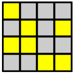

# Game of Life

# Project - Conway's Game of Life



The game of life was developed by British mathematician John Horton Conway in 1970. It involves a grid (the world) of cells. The grid of cells evolves according to the following rules:

1. **Death**. If a cell is alive (state = 1) it will die (state becomes 0) under the following circumstances.

	- Overpopulation: If the cell has four or more alive neighbours, it dies.
	- Loneliness: If the cell has one or fewer alive neighbours, it dies.

2. **Birth**. If a cell is dead (state = 0) it will come to life (state becomes 1) if it has exactly three alive neighbours (no more, no less).

3. **Stasis**. In all other cases, the cell state does not change. To be thorough, let's describe those scenarios.

	- Staying Alive: If a cell is alive and has exactly two or three live neighbours, it stays alive.
	- Staying Dead: If a cell is dead and has anything other than three live neighbours, it stays dead.

We are going to implement a version of [Conway's Game of Life](https://en.wikipedia.org/wiki/Conway's_Game_of_Life).  The [starter code](https://play.rust-lang.org/?version=stable&mode=debug&edition=2021&gist=66c823de3b26810d205e540ad471dad9) for this project can be found below.

```rust
#![allow(dead_code)]
#![allow(unused_variables)]

#[derive(Clone, Copy, PartialEq)]
enum Cell {
    Alive,
    Dead,
}

#[derive(Clone)]
struct Grid {
    width: usize,
    height: usize,
    cells: Vec<Cell>,
}

impl Grid {
    fn new(width: usize, height: usize) -> Grid {
        Grid {
            width,
            height,
            cells: vec![Cell::Dead; width * height],
        }
    }

    fn from_pattern(pattern: &[&str]) -> Grid {
        let height = pattern.len();
        let width = pattern[0].len();
        let cells = pattern
            .iter()
            .flat_map(|&row| row.chars())
            .map(|c| if c == 'O' { Cell::Alive } else { Cell::Dead })
            .collect();

        Grid {
            width,
            height,
            cells,
        }
    }

    fn get(&self, x: usize, y: usize) -> Cell {
        if x >= self.width || y >= self.height {
            Cell::Dead
        } else {
            self.cells[y * self.width + x]
        }
    }

    fn set(&mut self, x: usize, y: usize, cell: Cell) {
        if x < self.width && y < self.height {
            self.cells[y * self.width + x] = cell;
        }
    }

    fn count_alive_neighbors(&self, x: usize, y: usize) -> usize {
        let mut count = 0;
        // Row above
        if x > 0 && y > 0 && self.get(x - 1, y - 1) == Cell::Alive { count += 1; }
        if y > 0 && self.get(x, y - 1) == Cell::Alive { count += 1 }
        if x < self.width - 1 && y > 0 && self.get(x + 1, y - 1) == Cell::Alive { count += 1; }
        //
        // TODO
        //
        count
    }

    fn next_generation(&self) -> Grid {
        let new_grid = self.clone();
        //
        // TODO
        //
        new_grid
    }

    fn output(&self) {
        for y in 0..self.height {
            for x in 0..self.width {
                let symbol = match self.get(x, y) {
                    Cell::Alive => 'O',
                    Cell::Dead => '.',
                };
                print!("{}", symbol);
            }
            println!();
        }
    }
}

  

fn main() {
    let pattern = vec![
        "........",
        "....O...",
        "...OO...",
        "...O....",
        "........"];
  
    let grid = Grid::from_pattern(&pattern);

    println!("Initial Generation:");
    grid.output();
    println!("Number of Neightbours: {}", grid.count_alive_neighbors(4,2) );
}
```

with the following output,

```
Initial Generation:
........
....O...
...OO...
...O....
........
Number of Neightbours: 1
```

**Note:**  The starter code only detects neighbours in the row above a particular cell.

**Note:** The `get()` function allows us to model a 2-dimensional grid using a 1-dimensional [vector](notes/05-vectors/vectors.md) in **Rust**.  See this [note](/notes/14-game-of-life/get.md) for a brief explanation of how it does this.